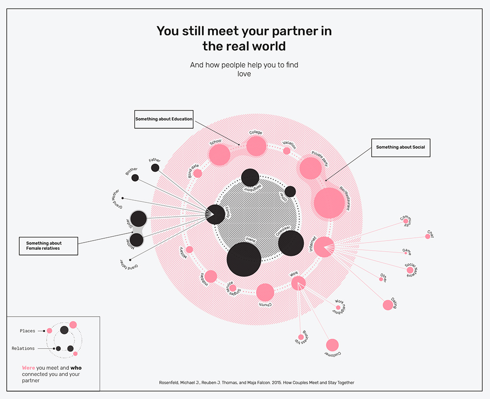

---

title: The drawings that defeat Google
layout: project

---

# You still meet your partner in the real world

Millions of doodles from all around the world have been collected by Google to feed a **neural network** capable of recognizing what is beeing drawn. This artificial intelligence is one of the ever-increasing algorithmic systems that are living with us.

It seems that we are on the verge of letting important decisions be taken by computers. **But what is lost in this process?** What can we learn from the Google's **rejected drawings**?

  
 

