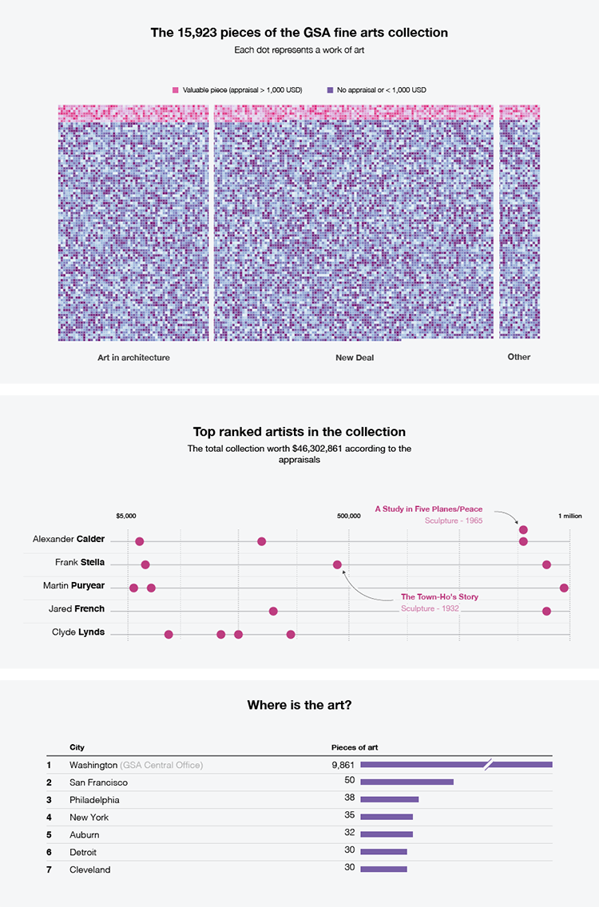

---

title: The hidden art of everydays buildings
layout: project

---

# The hidden art of everydays buildings
The Fine Arts Collection is one of the nation's oldest and largest public art collections. It consists of mural and easel paintings, sculptures, architectural and environmental artworks, as well as prints and other works.

Let's visualize this art collection locked away in federal buildings and, for the most part, hidden from the public.
  
  
