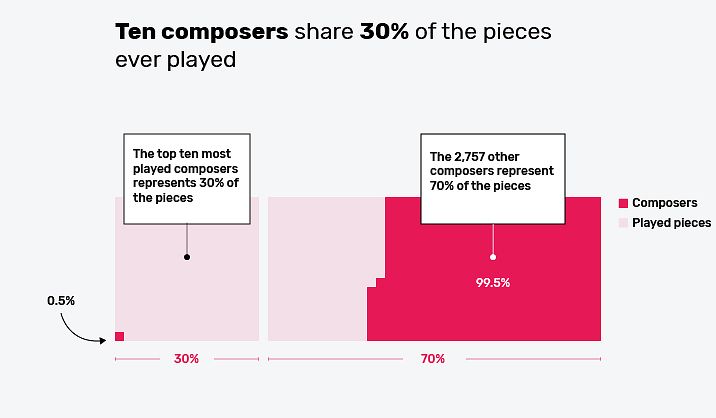
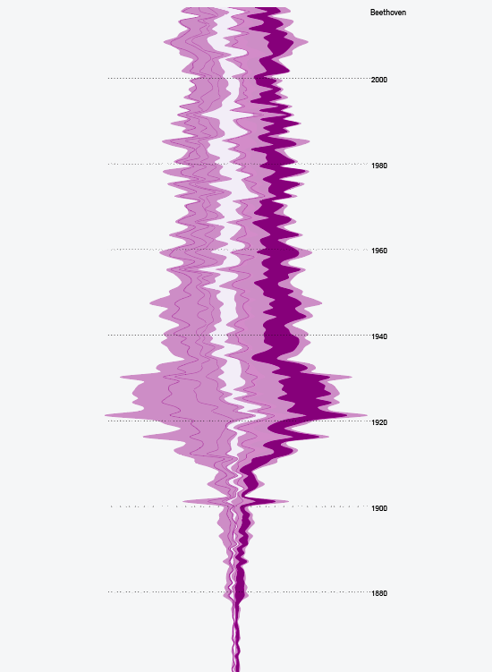

---

title: The drawings that defeat Google
layout: project

---

# The unmovable figures of classical music

Millions of doodles from all around the world have been collected by Google to feed a **neural network** capable of recognizing what is beeing drawn. This artificial intelligence is one of the ever-increasing algorithmic systems that are living with us.

It seems that we are on the verge of letting important decisions be taken by computers. **But what is lost in this process?** What can we learn from the Google's **rejected drawings**?

  
 

   
People playing at Google Quick Draw are asking to draw a concept in less than 20 seconds. The resulting drawings look like children doodles. But they are not. They are the drawings that everyone made one day.
Algorithmic systems tend to avoid what is not the norm, exclude eccentricity and prevent errors. But errors and eccentricity are what makes creativity and humanity.    

   Google's dataset shows that the most recognizable drawings are also the simplest ones. On this graphic, the drawings have been grouped by countries. The countries that use a logographic writting system, with a strong pictural culture, are the countries that produce the most accepted drawings.    

   
People playing at Google Quick Draw are asking to draw a concept in less than 20 seconds. The resulting drawings look like children doodles. But they are not. They are the drawings that everyone made one day.
Algorithmic systems tend to avoid what is not the norm, exclude eccentricity and prevent errors. But errors and eccentricity are what makes creativity and humanity.