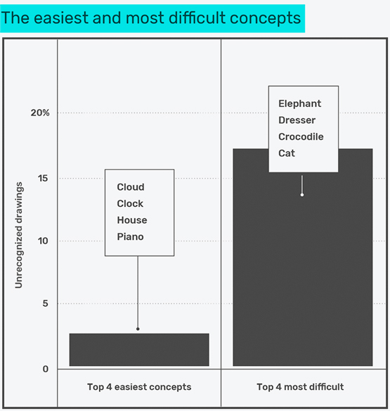

---

title: The drawings that defeat Google
layout: project

---

# The drawings that defeat Google

Millions of doodles from all around the world have been collected by Google to feed a **neural network** capable of recognizing what is beeing drawn. This system that learns by himself is the perfect illustration of a machine learning application.

It seems that we are on the verge of letting important decisions be taken by computers. **But what is lost in this process?** What can we learn from the **rejected drawings**?

  
 

   
Algorithmic systems tend to avoid what is not the norm, exclude eccentricity and prevent errors. But errors and eccentricity are what makes creativity and what makes humans human.
People playing at Google Quick Draw are asking to draw a concept in less than 20 seconds. These drawings look like children doodles. But they are not. They are the drawings that everyone has made one day.    

   Google's dataset shows that the most recognizable drawings are also the simplest ones. On this graphic, the average complexity and percentage of reconizable drawings have been plotted. The coutries that use a logographic writting system, with a strong pictural culture, are the coutries that produce the most accepted drawings.    

   South Africa and Hungary are the coutries that produce the most unrecognized drawings. Reasons?    

   AI is everywhere in the news and it seems that we are on the verge on letting some decisions be taken by computers. But **what is lost in the process?** Is AI making everything average, etc.    

   AI is everywhere in the news and it seems that we are on the verge on letting some decisions be taken by computers. But **what is lost in the process?** Is AI making everything average, etc.

**Time to decieve Google's expectations!**
[https://quickdraw.withgoogle.com/](https://quickdraw.withgoogle.com/)